# User Stories - Thị Trường Dữ Liệu Dựa Trên NFT

Tài liệu này mô tả các user stories từ các trường hợp đơn giản (happy cases) đến các trường hợp phức tạp (complex cases) trong hệ thống NFT-Based Data Marketplace.

## Mục Lục

1. [Các Trường Hợp Đơn Giản](#các-trường-hợp-đơn-giản)
2. [Các Trường Hợp Độ Phức Tạp Trung Bình](#các-trường-hợp-độ-phức-tạp-trung-bình)
3. [Các Trường Hợp Phức Tạp](#các-trường-hợp-phức-tạp)
4. [Các Trường Hợp Lỗi](#các-trường-hợp-lỗi)

---

## Các Trường Hợp Đơn Giản

### Story 1: Đăng Ký Người Dùng

**Với tư cách là** người dùng mới  
**Tôi muốn** đăng ký với tên và địa chỉ ví của tôi  
**Để** tôi có thể tham gia vào thị trường

**Tiêu Chí Chấp Nhận:**
- Người dùng cung cấp tên và địa chỉ ví duy nhất
- Hệ thống xác thực tính duy nhất (tên HOẶC ví phải duy nhất)
- Người dùng được lưu vào cơ sở dữ liệu
- Thông báo thành công được hiển thị

**Biểu Đồ Tuần Tự:**

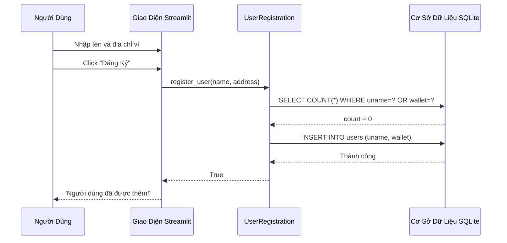

**Luồng Xử Lý:**
1. Người dùng điền form đăng ký
2. Hệ thống kiểm tra trùng lặp
3. Nếu không trùng, thêm người dùng mới
4. Hiển thị thông báo thành công

---

### Story 2: Xuất Bản Tài Sản Đơn Giản

**Với tư cách là** chủ sở hữu đã đăng ký  
**Tôi muốn** xuất bản một tài sản với giá và cài đặt bán lại  
**Để** người mua có thể mua nó

**Điều Kiện Tiên Quyết:**
- Chủ sở hữu đã có hợp đồng AssetAgreement được triển khai
- Chủ sở hữu đã đăng ký trong hệ thống

**Tiêu Chí Chấp Nhận:**
- File tài sản được lưu vào bộ nhớ cục bộ
- NFT được mint với metadata giá và resaleAllowed
- Bản ghi tài sản được lưu vào cơ sở dữ liệu
- Token ID được hiển thị

**Biểu Đồ Tuần Tự:**

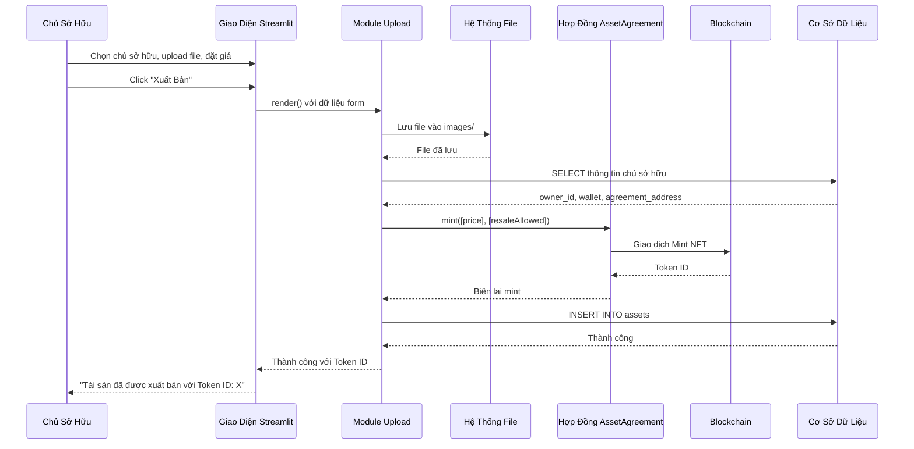

**Luồng Xử Lý:**
1. Chủ sở hữu upload file và đặt metadata
2. File được lưu vào bộ nhớ cục bộ
3. Lấy hợp đồng AssetAgreement hiện có của chủ sở hữu
4. Mint NFT với metadata
5. Lưu bản ghi tài sản vào cơ sở dữ liệu
6. Hiển thị thành công với Token ID

---

### Story 3: Mua Tài Sản Đơn Giản

**Với tư cách là** người mua  
**Tôi muốn** mua một tài sản từ thị trường  
**Để** tôi sở hữu tài sản đã được watermark

**Điều Kiện Tiên Quyết:**
- Người mua đã đăng ký
- Tài sản đang được bán
- Người mua có đủ số dư ETH

**Tiêu Chí Chấp Nhận:**
- Watermark được áp dụng vào tài sản
- Hash được tính toán và lưu trên blockchain
- Quyền sở hữu NFT được chuyển giao
- Thanh toán được phân phối đúng cách
- Tài sản đã watermark có thể tải xuống

**Biểu Đồ Tuần Tự:**

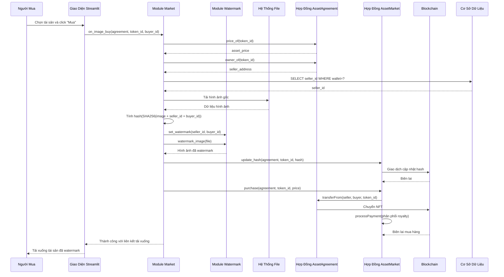

**Luồng Xử Lý:**
1. Người mua chọn tài sản và click Mua
2. Lấy thông tin tài sản từ blockchain
3. Tải hình ảnh gốc
4. Tạo watermark với seller_id và buyer_id
5. Tính hash của tài sản đã watermark
6. Cập nhật hash trên blockchain
7. Thực hiện giao dịch mua
8. Chuyển quyền sở hữu NFT
9. Phân phối thanh toán (royalty)
10. Cung cấp liên kết tải xuống

---

## Các Trường Hợp Độ Phức Tạp Trung Bình

### Story 4: Xuất Bản Tài Sản Với Tạo Hợp Đồng Mới

**Với tư cách là** chủ sở hữu mới  
**Tôi muốn** xuất bản tài sản đầu tiên của tôi  
**Để** hệ thống tự động tạo hợp đồng AssetAgreement cho tôi

**Điều Kiện Tiên Quyết:**
- Chủ sở hữu đã đăng ký nhưng chưa có hợp đồng AssetAgreement

**Tiêu Chí Chấp Nhận:**
- Hợp đồng AssetAgreement được triển khai qua Factory
- Địa chỉ hợp đồng được lưu vào bản ghi người dùng
- Approval được thiết lập cho hợp đồng Market
- NFT được mint thành công

**Biểu Đồ Tuần Tự:**

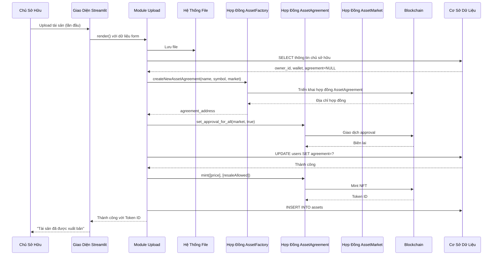

**Luồng Xử Lý:**
1. Chủ sở hữu upload tài sản đầu tiên
2. Hệ thống phát hiện chưa có hợp đồng AssetAgreement
3. Triển khai hợp đồng mới qua Factory
4. Thiết lập approval cho hợp đồng Market
5. Cập nhật bản ghi người dùng với địa chỉ hợp đồng
6. Mint NFT
7. Lưu bản ghi tài sản

---

### Story 5: Kịch Bản Bán Lại

**Với tư cách là** người mua đã mua một tài sản  
**Tôi muốn** bán lại tài sản tôi đã mua  
**Để** tôi có thể kiếm lợi nhuận từ việc bán lại

**Điều Kiện Tiên Quyết:**
- Người mua sở hữu một tài sản
- Tài sản có resaleAllowed = true
- Tài sản hiện không được bán

**Tiêu Chí Chấp Nhận:**
- Chủ sở hữu có thể chuyển đổi trạng thái bán
- Tài sản xuất hiện trong thị trường khi forSale = true
- Bán lại bao gồm royalty cho chủ sở hữu gốc
- Thanh toán được chia đúng giữa chủ sở hữu gốc và người bán

**Biểu Đồ Tuần Tự:**

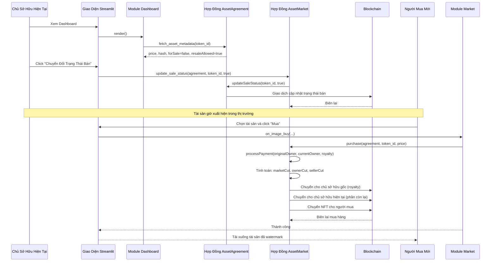

**Luồng Xử Lý:**
1. Chủ sở hữu xem dashboard
2. Chủ sở hữu chuyển đổi trạng thái bán thành true
3. Tài sản xuất hiện trong thị trường
4. Người mua mới mua tài sản
5. Thanh toán được phân phối:
   - Phí thị trường
   - Royalty chủ sở hữu gốc
   - Người bán hiện tại (phần còn lại)
6. NFT được chuyển cho người mua mới

---

### Story 6: Trích Xuất Watermark

**Với tư cách là** người vận hành thị trường hoặc điều tra viên  
**Tôi muốn** trích xuất watermark từ một tài sản bị rò rỉ  
**Để** tôi có thể xác định chủ sở hữu gốc và người mua

**Điều Kiện Tiên Quyết:**
- File tài sản đã watermark có sẵn
- Tài sản đã được mua qua thị trường

**Tiêu Chí Chấp Nhận:**
- Watermark được trích xuất thành công
- Owner ID và Buyer ID được xác định
- ID được ánh xạ sang tên người dùng từ cơ sở dữ liệu
- Kết quả được hiển thị

**Biểu Đồ Tuần Tự:**

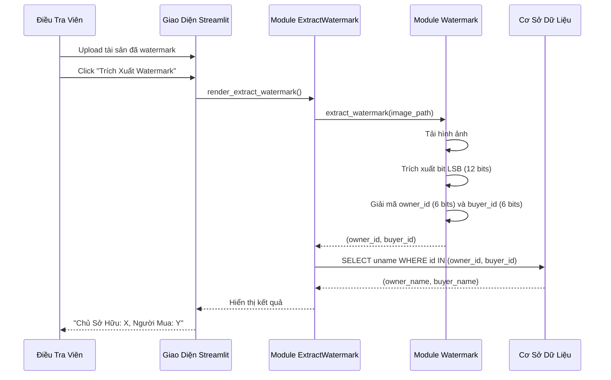

**Luồng Xử Lý:**
1. Upload tài sản đã watermark
2. Trích xuất watermark sử dụng thuật toán LSB/SSL
3. Giải mã owner_id và buyer_id
4. Truy vấn cơ sở dữ liệu cho tên người dùng
5. Hiển thị kết quả ánh xạ

---

## Các Trường Hợp Phức Tạp

### Story 7: Truy Vết Dựa Trên Hash

**Với tư cách là** người vận hành thị trường  
**Tôi muốn** truy vết lịch sử quyền sở hữu tài sản sử dụng hash  
**Để** tôi có thể xác minh bản ghi giao dịch trên blockchain

**Điều Kiện Tiên Quyết:**
- File tài sản gốc có sẵn
- Seller ID và Buyer ID được biết
- Giao dịch đã được ghi lại trên blockchain

**Tiêu Chí Chấp Nhận:**
- Hash được tính toán đúng
- Truy vấn blockchain trả về bản ghi bán hàng
- Token ID và địa chỉ được hiển thị
- Xử lý trường hợp bản ghi không tồn tại

**Biểu Đồ Tuần Tự:**

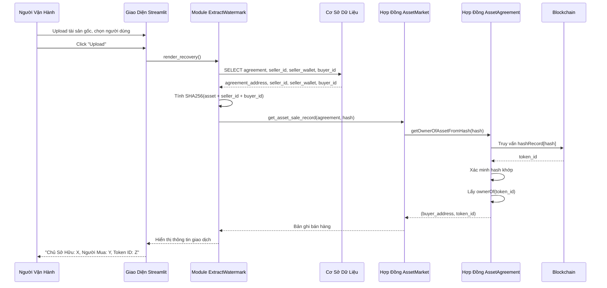

**Luồng Xử Lý:**
1. Upload tài sản gốc và chọn người dùng
2. Lấy địa chỉ agreement và user ID từ cơ sở dữ liệu
3. Tính hash (SHA256 của asset + seller_id + buyer_id)
4. Truy vấn blockchain cho bản ghi bán hàng
5. Hợp đồng xác minh hash tồn tại và trả về thông tin token
6. Hiển thị bản ghi giao dịch

---

### Story 8: Luồng Giao Dịch Nhiều Bước

**Với tư cách là** người mua  
**Tôi muốn** hoàn thành một giao dịch mua hàng  
**Để** tất cả các bước (watermarking, cập nhật hash, thanh toán) được thực hiện nguyên tử

**Điều Kiện Tiên Quyết:**
- Tài sản đang được bán
- Người mua có đủ số dư
- Tất cả hợp đồng được cấu hình đúng

**Tiêu Chí Chấp Nhận:**
- Tất cả các bước hoàn thành thành công
- Nếu bất kỳ bước nào thất bại, giao dịch được rollback
- Chi phí gas được theo dõi
- Thông tin thời gian được ghi log

**Biểu Đồ Tuần Tự:**

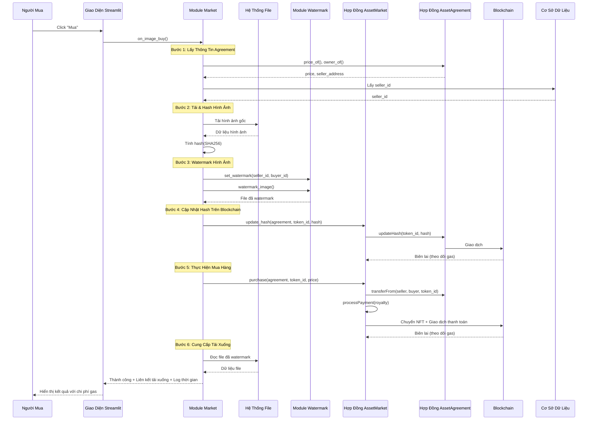

**Luồng Xử Lý:**
1. Lấy thông tin agreement và seller
2. Tải hình ảnh và tính hash
3. Áp dụng watermark
4. Cập nhật hash trên blockchain (theo dõi gas)
5. Thực hiện giao dịch mua (theo dõi gas)
6. Cung cấp liên kết tải xuống
7. Hiển thị thông tin thời gian và gas

---

### Story 9: Quản Lý Tài Sản Trên Dashboard

**Với tư cách là** người dùng  
**Tôi muốn** xem tất cả tài sản tôi sở hữu và quản lý trạng thái bán của chúng  
**Để** tôi có thể kiểm soát tài sản nào có sẵn để mua

**Điều Kiện Tiên Quyết:**
- Người dùng đã đăng ký
- Người dùng sở hữu ít nhất một tài sản

**Tiêu Chí Chấp Nhận:**
- Tất cả tài sản sở hữu được hiển thị
- Metadata tài sản được hiển thị (giá, trạng thái bán lại, trạng thái bán)
- Người dùng có thể chuyển đổi trạng thái bán nếu bán lại được phép
- Thay đổi được phản ánh trên blockchain

**Biểu Đồ Tuần Tự:**

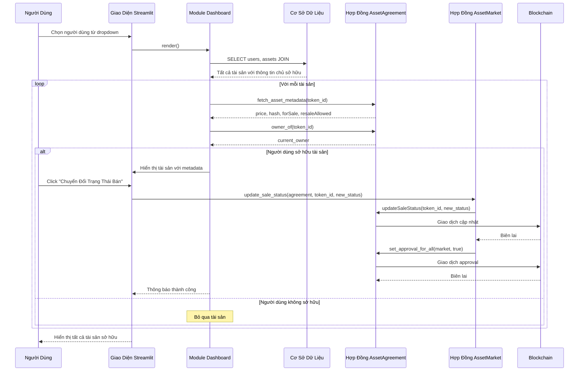

**Luồng Xử Lý:**
1. Người dùng chọn tài khoản của họ
2. Truy vấn tất cả tài sản từ cơ sở dữ liệu
3. Với mỗi tài sản:
   - Lấy metadata từ blockchain
   - Kiểm tra quyền sở hữu
   - Hiển thị nếu sở hữu
4. Người dùng có thể chuyển đổi trạng thái bán
5. Cập nhật blockchain và thiết lập approvals
6. Làm mới hiển thị

---

### Story 10: Cache Triển Khai Hợp Đồng

**Với tư cách là** quản trị viên hệ thống  
**Tôi muốn** đảm bảo hợp đồng chỉ được triển khai một lần  
**Để** chúng ta không lãng phí gas và duy trì tính nhất quán

**Điều Kiện Tiên Quyết:**
- Hệ thống đang khởi động
- contracts.json có thể tồn tại hoặc không

**Tiêu Chí Chấp Nhận:**
- Kiểm tra contracts.json cho địa chỉ hiện có
- Chỉ triển khai nếu chưa được cache
- Lưu địa chỉ mới vào cache
- Trả về địa chỉ đã cache nếu tồn tại

**Biểu Đồ Tuần Tự:**

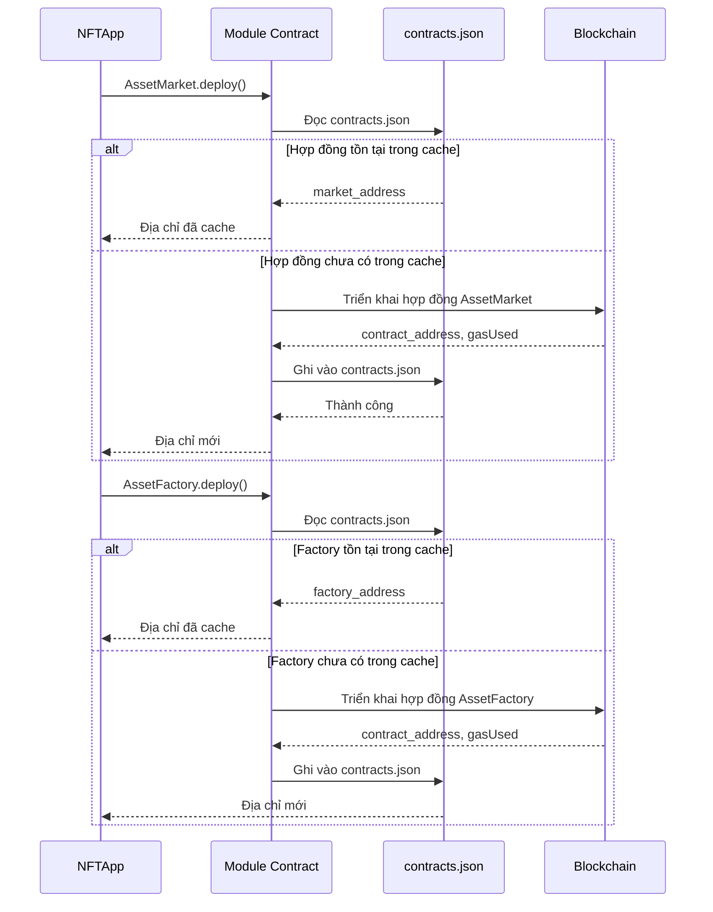

**Luồng Xử Lý:**
1. Khởi tạo ứng dụng yêu cầu triển khai hợp đồng
2. Kiểm tra cache contracts.json
3. Nếu đã cache, trả về địa chỉ
4. Nếu chưa cache, triển khai hợp đồng mới
5. Lưu địa chỉ vào cache
6. Trả về địa chỉ

---

## Các Trường Hợp Lỗi

### Story 11: Đăng Ký Người Dùng Trùng Lặp

**Với tư cách là** người dùng  
**Tôi muốn** thấy thông báo lỗi khi đăng ký với tên hoặc ví trùng lặp  
**Để** tôi biết tại sao đăng ký thất bại

**Biểu Đồ Tuần Tự:**

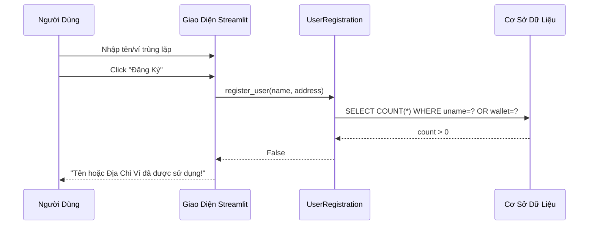

---

### Story 12: Mua Hàng Không Đủ Số Dư

**Với tư cách là** người mua  
**Tôi muốn** thấy lỗi khi tôi không có đủ ETH  
**Để** tôi biết giao dịch thất bại

**Biểu Đồ Tuần Tự:**

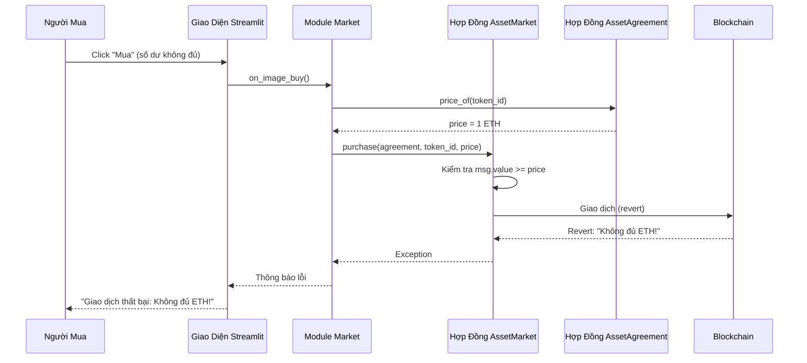

---

### Story 13: Tài Sản Không Được Bán

**Với tư cách là** người mua  
**Tôi muốn** thấy rằng một tài sản không có sẵn để mua  
**Để** tôi không thử các giao dịch không hợp lệ

**Biểu Đồ Tuần Tự:**

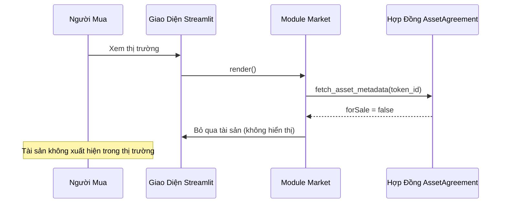

---

### Story 14: Lỗi Trích Xuất Watermark

**Với tư cách là** điều tra viên  
**Tôi muốn** thấy lỗi khi trích xuất watermark thất bại  
**Để** tôi biết file có thể không được watermark hoặc bị hỏng

**Biểu Đồ Tuần Tự:**

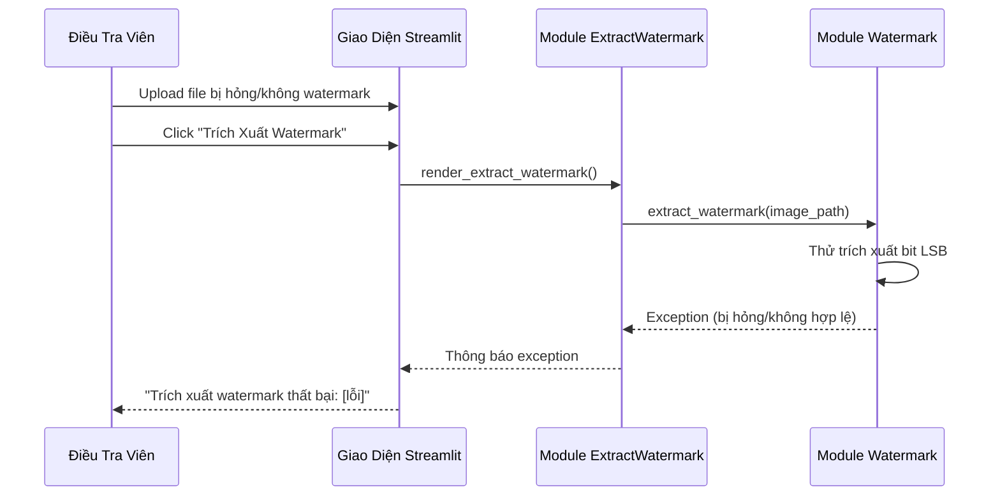

---

### Story 15: Không Tìm Thấy Bản Ghi Hash

**Với tư cách là** người vận hành  
**Tôi muốn** thấy thông báo khi bản ghi hash không tồn tại  
**Để** tôi biết giao dịch có thể chưa xảy ra

**Biểu Đồ Tuần Tự:**

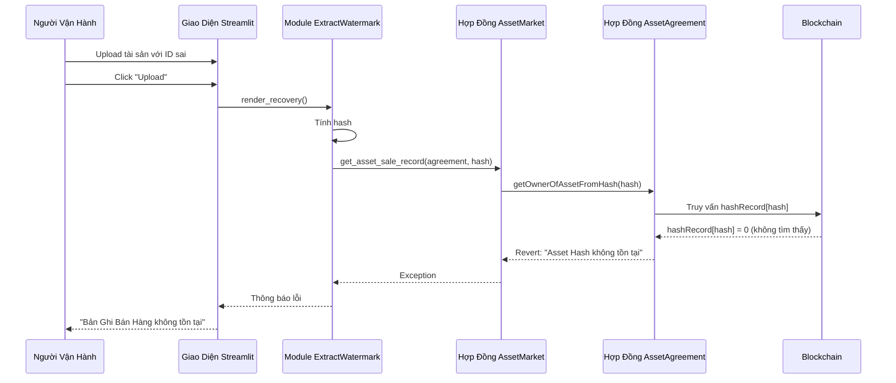

---

## Tóm Tắt User Stories

### Các Trường Hợp Đơn Giản (Stories 1-3)
- Các thao tác CRUD cơ bản
- Giao dịch một bước
- Tương tác người dùng trực tiếp

### Các Trường Hợp Trung Bình (Stories 4-6)
- Quy trình nhiều bước
- Tạo hợp đồng
- Kịch bản bán lại
- Trích xuất watermark

### Các Trường Hợp Phức Tạp (Stories 7-10)
- Giao dịch nhiều bên
- Truy vấn blockchain
- Quản lý tài sản
- Khởi tạo hệ thống

### Các Trường Hợp Lỗi (Stories 11-15)
- Thất bại xác thực
- Giao dịch revert
- Kịch bản thiếu dữ liệu
- Xử lý lỗi

---

## Ghi Chú Kỹ Thuật

### Tối Ưu Hóa Gas
- Triển khai hợp đồng được cache để tránh triển khai lại
- Các thao tác batch khi có thể (ERC721A cho minting)

### Cân Nhắc Bảo Mật
- Kiểm tra kiểm soát truy cập trước các thao tác
- Bảo vệ re-entrancy trong smart contracts
- Xác thực đầu vào ở nhiều lớp

### Chỉ Số Hiệu Suất
- Mỗi thao tác theo dõi thời gian
- Chi phí gas được ghi log
- Truy vấn cơ sở dữ liệu được tối ưu với indexes

### Phương Pháp Watermarking
- LSB (Least Significant Bit): Hiện đang sử dụng
- SSL (Self-Supervised Learning): Có sẵn nhưng tùy chọn
- Lựa chọn phương pháp qua sidebar UI

