# User Stories - NFT-Based Data Marketplace

Tài liệu này mô tả các user stories từ các trường hợp đơn giản (happy cases) đến các trường hợp phức tạp (complex cases) trong hệ thống NFT-Based Data Marketplace.

## Mục Lục

1. [Simple Happy Cases](#simple-happy-cases)
2. [Medium Complexity Cases](#medium-complexity-cases)
3. [Complex Cases](#complex-cases)
4. [Error Cases](#error-cases)

---

## Simple Happy Cases

### Story 1: User Registration (Đăng ký người dùng)

**As a** new user  
**I want to** register with my name and wallet address  
**So that** I can participate in the marketplace

**Acceptance Criteria:**
- User provides unique name and wallet address
- System validates uniqueness (name OR wallet must be unique)
- User is saved to database
- Success message is displayed

**Sequence Diagram:**

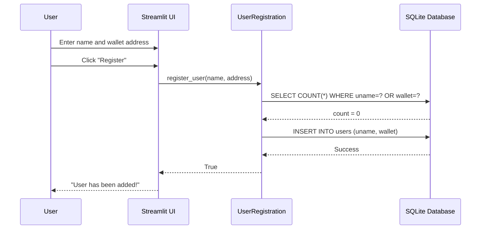

**Flow:**
1. User fills registration form
2. System checks for duplicates
3. If no duplicate, insert new user
4. Display success message

---

### Story 2: Simple Asset Publishing (Xuất bản tài sản đơn giản)

**As a** registered owner  
**I want to** publish an asset with price and resale settings  
**So that** buyers can purchase it

**Preconditions:**
- Owner already has AssetAgreement contract deployed
- Owner is registered in system

**Acceptance Criteria:**
- Asset file is saved to local storage
- NFT is minted with price and resaleAllowed metadata
- Asset record is saved to database
- Token ID is displayed

**Sequence Diagram:**

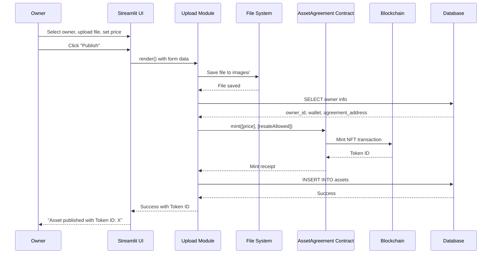

**Flow:**
1. Owner uploads file and sets metadata
2. File saved to local storage
3. Get owner's existing AssetAgreement contract
4. Mint NFT with metadata
5. Save asset record to database
6. Display success with Token ID

---

### Story 3: Simple Purchase (Mua tài sản đơn giản)

**As a** buyer  
**I want to** purchase an asset from the marketplace  
**So that** I own the watermarked asset

**Preconditions:**
- Buyer is registered
- Asset is for sale
- Buyer has sufficient ETH balance

**Acceptance Criteria:**
- Watermark is applied to asset
- Hash is computed and stored on blockchain
- NFT ownership is transferred
- Payment is distributed correctly
- Watermarked asset is downloadable

**Sequence Diagram:**

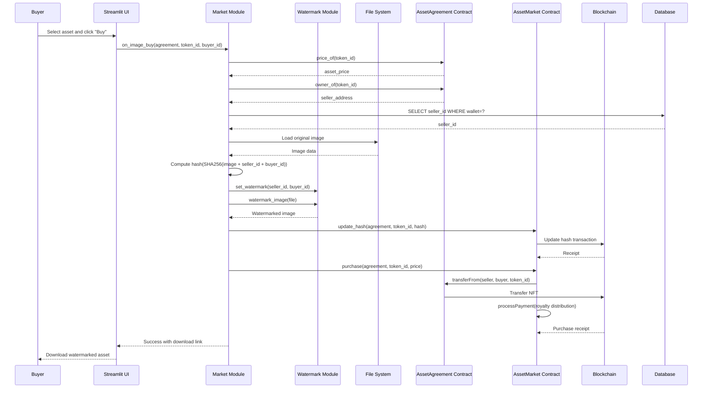

**Flow:**
1. Buyer selects asset and clicks Buy
2. Get asset info from blockchain
3. Load original image
4. Create watermark with seller_id and buyer_id
5. Compute hash of watermarked asset
6. Update hash on blockchain
7. Execute purchase transaction
8. Transfer NFT ownership
9. Distribute payment (royalty)
10. Provide download link

---

## Medium Complexity Cases

### Story 4: Asset Publishing with Contract Creation (Xuất bản với tạo contract mới)

**As a** new owner  
**I want to** publish my first asset  
**So that** the system creates my AssetAgreement contract automatically

**Preconditions:**
- Owner is registered but has no AssetAgreement contract yet

**Acceptance Criteria:**
- AssetAgreement contract is deployed via Factory
- Contract address is saved to user record
- Approval is set for Market contract
- NFT is minted successfully

**Sequence Diagram:**

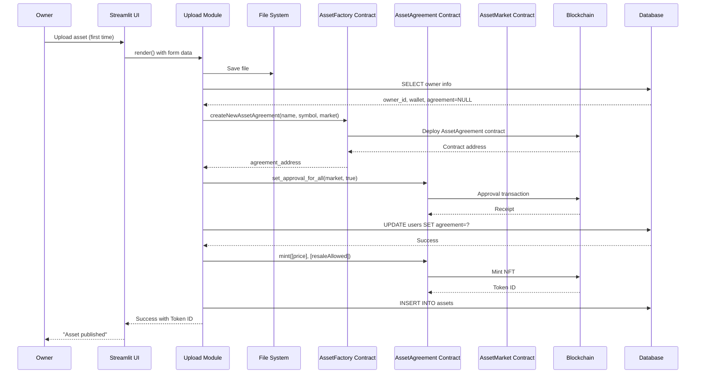

**Flow:**
1. Owner uploads first asset
2. System detects no AssetAgreement contract
3. Deploy new contract via Factory
4. Set approval for Market contract
5. Update user record with contract address
6. Mint NFT
7. Save asset record

---

### Story 5: Resale Scenario (Kịch bản bán lại)

**As a** buyer who purchased an asset  
**I want to** resell the asset I bought  
**So that** I can profit from the resale

**Preconditions:**
- Buyer owns an asset
- Asset has resaleAllowed = true
- Asset is currently not for sale

**Acceptance Criteria:**
- Owner can toggle sale status
- Asset appears in marketplace when forSale = true
- Resale includes royalty to original owner
- Payment is split correctly between original owner and seller

**Sequence Diagram:**

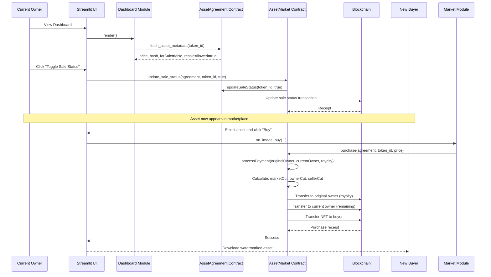

**Flow:**
1. Owner views dashboard
2. Owner toggles sale status to true
3. Asset appears in marketplace
4. New buyer purchases asset
5. Payment is distributed:
   - Market cut
   - Original owner royalty
   - Current seller (remaining)
6. NFT transferred to new buyer

---

### Story 6: Watermark Extraction (Trích xuất watermark)

**As a** marketplace operator or investigator  
**I want to** extract watermark from a leaked asset  
**So that** I can identify the original owner and buyer

**Preconditions:**
- Watermarked asset file is available
- Asset was purchased through marketplace

**Acceptance Criteria:**
- Watermark is extracted successfully
- Owner ID and Buyer ID are identified
- IDs are mapped to user names from database
- Result is displayed

**Sequence Diagram:**

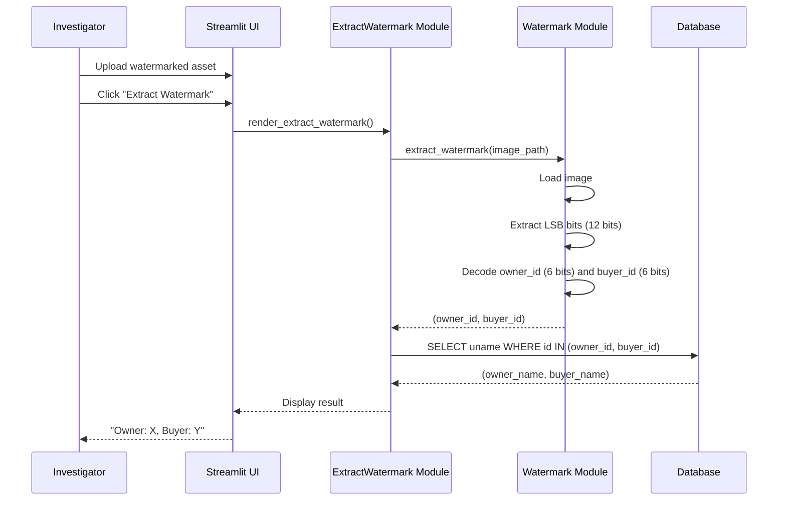

**Flow:**
1. Upload watermarked asset
2. Extract watermark using LSB/SSL algorithm
3. Decode owner_id and buyer_id
4. Query database for user names
5. Display mapping result

---

## Complex Cases

### Story 7: Hash-based Traceability (Truy vết dựa trên hash)

**As a** marketplace operator  
**I want to** trace asset ownership history using hash  
**So that** I can verify transaction records on blockchain

**Preconditions:**
- Original asset file is available
- Seller and buyer IDs are known
- Transaction was recorded on blockchain

**Acceptance Criteria:**
- Hash is computed correctly
- Blockchain query returns sale record
- Token ID and addresses are displayed
- Handles case when record doesn't exist

**Sequence Diagram:**

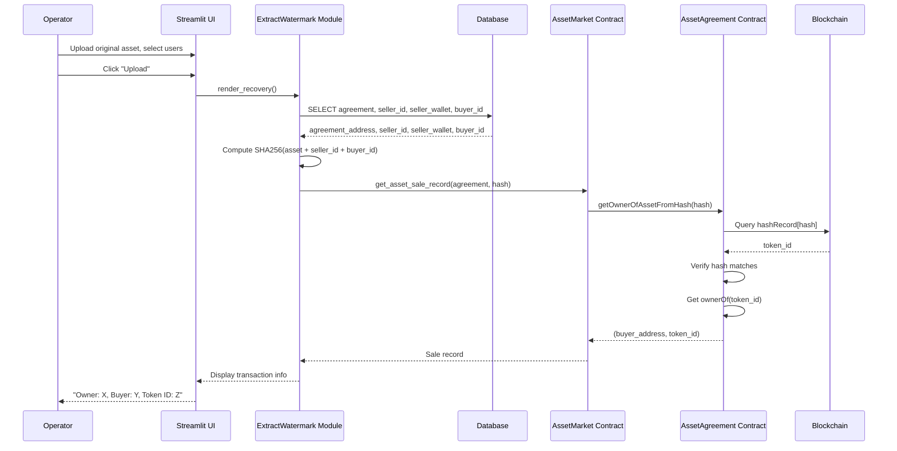

**Flow:**
1. Upload original asset and select users
2. Get agreement address and user IDs from database
3. Compute hash (SHA256 of asset + seller_id + buyer_id)
4. Query blockchain for sale record
5. Contract verifies hash exists and returns token info
6. Display transaction record

---

### Story 8: Multi-step Transaction Flow (Luồng giao dịch nhiều bước)

**As a** buyer  
**I want to** complete a purchase transaction  
**So that** all steps (watermarking, hash update, payment) are executed atomically

**Preconditions:**
- Asset is for sale
- Buyer has sufficient balance
- All contracts are properly configured

**Acceptance Criteria:**
- All steps complete successfully
- If any step fails, transaction is rolled back
- Gas costs are tracked
- Timing information is logged

**Sequence Diagram:**

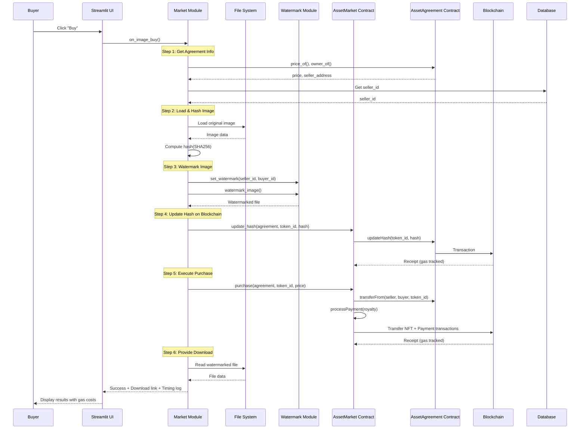

**Flow:**
1. Get agreement and seller info
2. Load image and compute hash
3. Apply watermark
4. Update hash on blockchain (track gas)
5. Execute purchase transaction (track gas)
6. Provide download link
7. Display timing and gas information

---

### Story 9: Dashboard Asset Management (Quản lý tài sản trên Dashboard)

**As a** user  
**I want to** view all my owned assets and manage their sale status  
**So that** I can control which assets are available for purchase

**Preconditions:**
- User is registered
- User owns at least one asset

**Acceptance Criteria:**
- All owned assets are displayed
- Asset metadata is shown (price, resale status, sale status)
- User can toggle sale status if resale is allowed
- Changes are reflected on blockchain

**Sequence Diagram:**

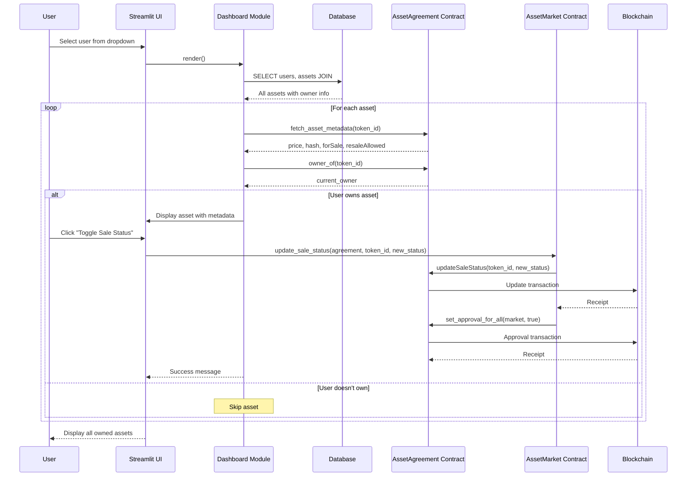

**Flow:**
1. User selects their account
2. Query all assets from database
3. For each asset:
   - Get metadata from blockchain
   - Check ownership
   - Display if owned
4. User can toggle sale status
5. Update blockchain and set approvals
6. Refresh display

---

### Story 10: Contract Deployment Caching (Cache deployment contract)

**As a** system administrator  
**I want to** ensure contracts are deployed only once  
**So that** we don't waste gas and maintain consistency

**Preconditions:**
- System is starting up
- contracts.json may or may not exist

**Acceptance Criteria:**
- Check contracts.json for existing addresses
- Deploy only if not cached
- Save new addresses to cache
- Return cached address if exists

**Sequence Diagram:**

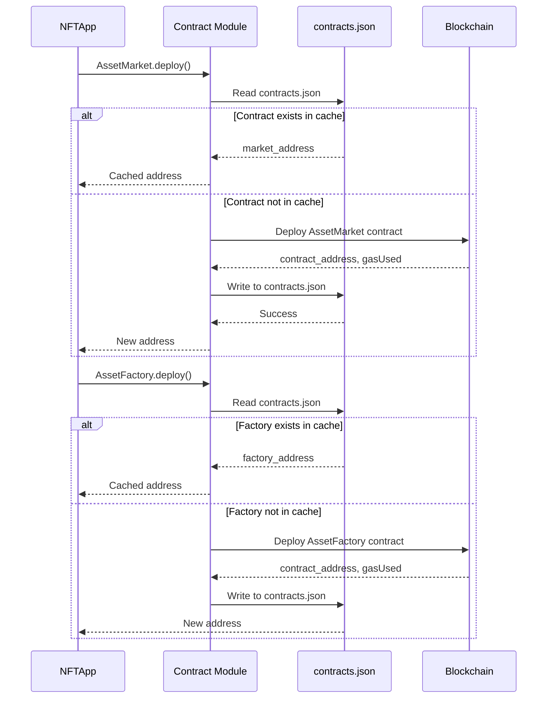

**Flow:**
1. App initialization requests contract deployment
2. Check contracts.json cache
3. If cached, return address
4. If not cached, deploy new contract
5. Save address to cache
6. Return address

---

## Error Cases

### Story 11: Duplicate User Registration (Đăng ký trùng lặp)

**As a** user  
**I want to** see an error message when registering with duplicate name or wallet  
**So that** I know why registration failed

**Sequence Diagram:**

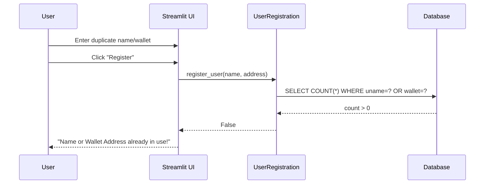

---

### Story 12: Insufficient Balance Purchase (Mua không đủ số dư)

**As a** buyer  
**I want to** see an error when I don't have enough ETH  
**So that** I know the transaction failed

**Sequence Diagram:**

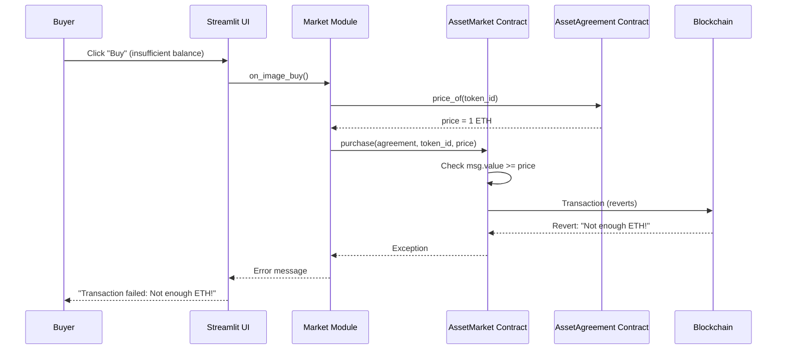

---

### Story 13: Asset Not For Sale (Tài sản không bán)

**As a** buyer  
**I want to** see that an asset is not available for purchase  
**So that** I don't attempt invalid transactions

**Sequence Diagram:**

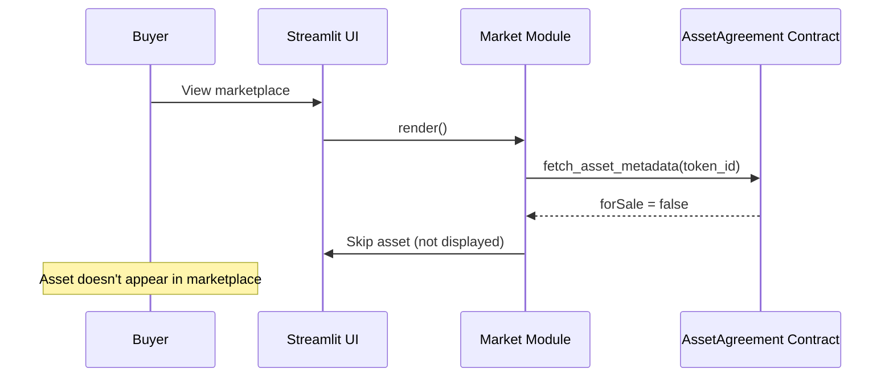

---

### Story 14: Watermark Extraction Failure (Lỗi trích xuất watermark)

**As a** investigator  
**I want to** see an error when watermark extraction fails  
**So that** I know the file may not be watermarked or is corrupted

**Sequence Diagram:**

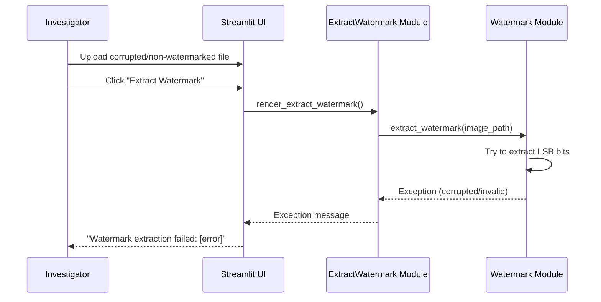

---

### Story 15: Hash Record Not Found (Không tìm thấy hash record)

**As a** operator  
**I want to** see a message when hash record doesn't exist  
**So that** I know the transaction may not have occurred

**Sequence Diagram:**

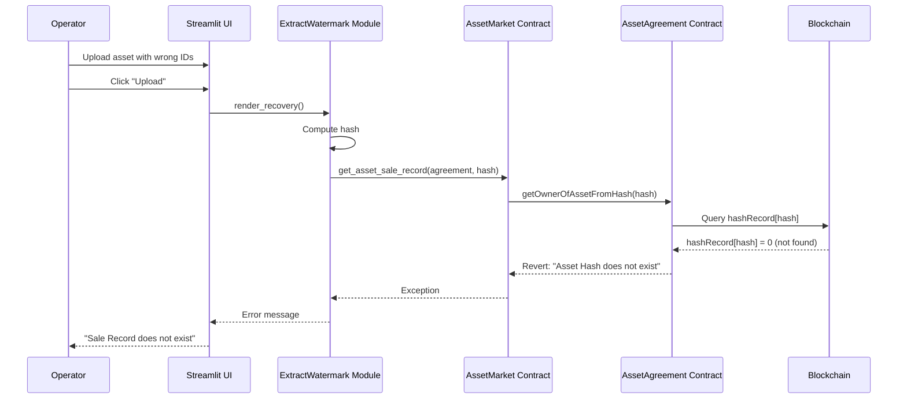

---

## Summary of User Stories

### Simple Cases (Stories 1-3)
- Basic CRUD operations
- Single-step transactions
- Direct user interactions

### Medium Cases (Stories 4-6)
- Multi-step processes
- Contract creation
- Resale scenarios
- Watermark extraction

### Complex Cases (Stories 7-10)
- Multi-party transactions
- Blockchain queries
- Asset management
- System initialization

### Error Cases (Stories 11-15)
- Validation failures
- Transaction reverts
- Missing data scenarios
- Error handling

---

## Technical Notes

### Gas Optimization
- Contract deployment is cached to avoid redeployment
- Batch operations where possible (ERC721A for minting)

### Security Considerations
- Access control checks before operations
- Re-entrancy protection in smart contracts
- Input validation at multiple layers

### Performance Metrics
- Each operation tracks timing
- Gas costs are logged
- Database queries are optimized with indexes

### Watermarking Methods
- LSB (Least Significant Bit): Currently used
- SSL (Self-Supervised Learning): Available but optional
- Method selection via UI sidebar

